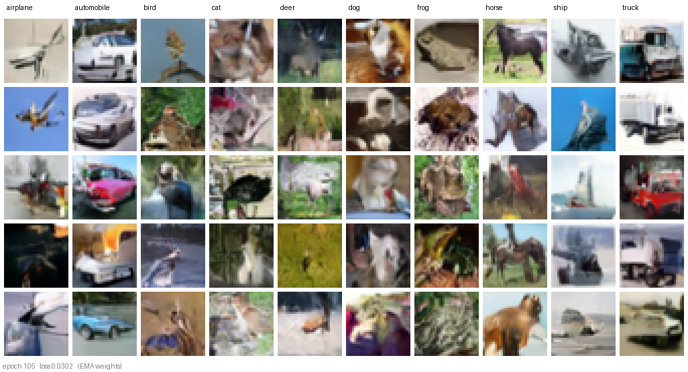
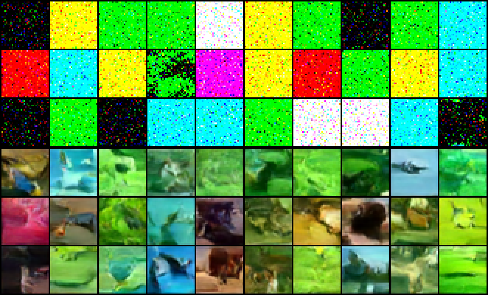
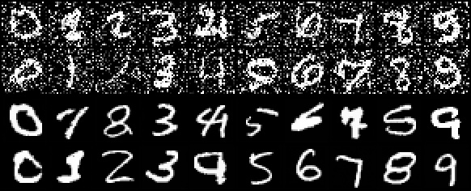

# MNIST and CIFAR-10 Conditional Diffusion Models

A comprehensive implementation of conditional diffusion models capable of generating high-quality images of handwritten digits (MNIST) and everyday objects (CIFAR-10). This project demonstrates state-of-the-art generative modeling using modern deep learning techniques.

## 🎯 What This Project Does

This codebase implements **conditional diffusion models** that can generate realistic images from noise by learning to reverse a gradual noising process. The models are "conditional" because they can generate specific types of images:

- **MNIST Mode**: Generate images of specific handwritten digits (0-9)
- **CIFAR-10 Mode**: Generate images of specific object classes (airplane, automobile, bird, cat, deer, dog, frog, horse, ship, truck)



*`cifar10_optimized` (20M parameters, no attention) after 105 epochs (~41k steps) on a DGX Spark. Every image is 32x32 like the training data, shown 3x. Columns are the requested class; rows are 5 independent samples from the same weights.*

## 🚀 Key Features

- **Conditional Generation**: Generate images of specific classes/digits
- **Multiple Datasets**: Support for both MNIST (grayscale) and CIFAR-10 (color)
- **Advanced Architecture**: U-Net with self-attention layers for capturing global dependencies
- **Multi-GPU Training**: Automatic DataParallel support for faster training
- **Flexible Noise Schedules**: Linear and cosine beta schedules
- **Interactive Inference**: Real-time image generation with live display
- **Checkpoint Management**: Automatic saving/loading with compatibility checking
- **Learning Rate Scheduling**: OneCycleLR with optional learning rate overrides

## 🏗️ Architecture Overview

### Core Components

1. **Conditional U-Net**: The main neural network that predicts noise to remove from images
2. **Self-Attention Layers**: Capture long-range dependencies across the image
3. **Diffusion Process**: Mathematical framework for adding/removing noise
4. **Training Loop**: Handles batch processing, loss computation, and optimization
5. **Inference Engine**: Generates new images from pure noise

### Technical Highlights

- **Adaptive Capacity Scaling**: Model automatically scales complexity based on dataset (1.5x larger for CIFAR-10)
- **Multi-Head Attention**: 8 attention heads for diverse feature relationships
- **Residual Connections**: Improved gradient flow and feature preservation
- **Group Normalization**: Better stability than batch normalization
- **SiLU Activation**: Smooth, modern activation function

## 📂 Which file do I run?

**`diffuser_optimized_Sept_16_26.py` — this one.** It is the current, working implementation and the
only script you need. It contains every fix and improvement from Sep 2026: corrected DDPM sampler,
corrected CIFAR noise schedule, EMA weights, horizontal-flip augmentation, bf16 + `torch.compile`
speed path, and the labeled 10x5 sample grids. It produced every image in this README.
(It was called `diffuser_optimized_Oct_25_25.py` until Sep 17, 2026 — same file, renamed.)

The other scripts are kept for history only:

| File | What it is | Status |
|---|---|---|
| `mnistdiffuser_individual_Jan_21_25.py` | First version (Jan 2025). MNIST only, tiny model, one image at a time. | Legacy. Still has the original sampler bug. |
| `diffuser_CIFAR_MNIST_Jan_23_25.py` | Added CIFAR-10 and a bigger U-Net. No attention, shared MNIST/CIFAR defaults, LR default 5e-3. | Legacy. Sampler bug fixed for consistency; otherwise unchanged. |
| `diffuser_plot_loss_Oct_25_25.py` | Helper: plots loss curves from saved checkpoints. Not a trainer. | Utility. |

## 📋 Requirements

```bash
pip install torch>=2.0.0 torchvision>=0.15.0 matplotlib>=3.5.0 pillow>=9.0.0 numpy>=1.21.0
```

On a DGX Spark / GB10 use the CUDA-13 build instead — see `diffusers_requirements.txt` and
"Speed on the DGX Spark" below.

## 🎮 Quick Start

### 1. Choose Your Dataset

```bash
python diffuser_optimized_Sept_16_26.py
```

The script will prompt you to choose a dataset preset:

| Menu | Preset | Network | Use it when |
|---|---|---|---|
| `3` | `CIFAR10_OPTIMIZED` | `ConditionalUNet`, 20M params, no attention | Fast; the "good enough" CIFAR option. Plateaus at the quality shown at the top of this README. |
| `4` | `CIFAR10_DDPM` | `DDPMUNet`, 36M params, attention, classifier-free guidance | **Best quality.** The published DDPM recipe. See "Why CIFAR plateaus — and the `cifar10_ddpm` option". |
| `5` | `MNIST_OPTIMIZED` | `ConditionalUNet`, small | MNIST. |

(`1`/`2` are the original `mnist` / `cifar10` presets, kept for compatibility; the `cifar10` one is a
791M-parameter network and is not recommended.)

### 2. Training Mode

```bash
# Interactive training setup
python diffuser_optimized_Sept_16_26.py --mode train
```

The script will guide you through parameter selection with sensible defaults.

### 3. Inference Mode

```bash
# Interactive image generation
python diffuser_optimized_Sept_16_26.py --mode inference
```

Generate images of specific digits or object classes in real-time.

## 🔧 Configuration Guide

### Critical Parameters

| Parameter | MNIST Default | CIFAR-10 Default | Description |
|-----------|---------------|------------------|-------------|
| `timesteps` | 500 | 500 | Total diffusion steps (higher = smoother but slower) |
| `beta_start` | 1e-5 | 2e-4 | Initial noise level (gentle early noise) |
| `beta_end` | 0.01 | 0.04 | Final noise level (complete randomization). CIFAR values = DDPM's (1e-4, 0.02 @ T=1000) rescaled to T=500 so x_T is actually noise (alpha_bar_T ≈ 4e-5; the old 0.012 left alpha_bar_T ≈ 0.05, i.e. 22% of the image still in x_T) |
| `emb_dim` | 32 | 128 | Embedding dimension (higher for complex images) |
| `batch_size` | 128 | 32 | Training batch size (lower for larger models) |
| `learning_rate` | 1e-3 | 1e-4 | Optimization step size |

### Advanced Options

- **Attention**: Enable self-attention layers for better global structure understanding
- **Noise Schedule**: Choose between 'linear' (simple) or 'cosine' (smoother) schedules
- **Dynamic Noise Scaling**: Gradually reduce noise during sampling for cleaner results
- **Multi-GPU**: Automatic parallelization across available GPUs

## 🎨 How Diffusion Models Work

### The Two-Phase Process

1. **Forward Diffusion (Fixed)**:
   - Start with clean image
   - Gradually add Gaussian noise over T timesteps
   - By step T: image becomes pure random noise

2. **Reverse Diffusion (Learned)**:
   - Start with pure noise
   - Neural network predicts and removes noise at each step
   - After T steps: get clean image matching desired class

### Mathematical Foundation

The model learns to predict the noise ε that was added at each timestep:

```
Loss = ||ε - ε̂_θ(xₜ, t, class)||²
```

Where:
- `xₜ`: Noisy image at timestep t
- `t`: Current timestep (how noisy the image is)
- `class`: Desired output class (digit 0-9 or object type)
- `ε̂_θ`: Network's prediction of the added noise

### The Reverse Step — and the bug that made CIFAR fail (fixed Sep 2026)

Training was always fine. The network learned to predict noise correctly on both MNIST and CIFAR
(the loss curves were healthy). The problem was in **sampling**: how each predicted noise was used
to take one step from `x_t` back to `x_{t-1}`.

**What a reverse step is supposed to do.** Given the noisy image `x_t` and the network's guess
of the clean image `x̂₀ = (x_t − √(1−ᾱ_t)·ε̂) / √ᾱ_t`, DDPM (Ho et al. 2020, Eq. 7) says the
next image is drawn from a Gaussian whose mean is a *weighted blend of `x̂₀` and `x_t`*:

```
mean_{t-1} =  [ √ᾱ_{t-1} · β_t / (1 − ᾱ_t) ] · x̂₀   +   [ √α_t · (1 − ᾱ_{t-1}) / (1 − ᾱ_t) ] · x_t
var_{t-1}  =    β_t · (1 − ᾱ_{t-1}) / (1 − ᾱ_t)
```

(`β_t` = noise added at step t, `α_t = 1 − β_t`, `ᾱ_t = α_1·α_2·…·α_t` = how much clean signal
survives to step t.) The key behaviour: **early (t ≈ T) the weight on `x_t` is ≈ 1**, so the
sampler trusts the noisy image and moves slowly; **late (t → 0) the weight on `x̂₀` → 1**, so
the last steps snap onto the clean prediction. At `t = 0` the weight on `x_t` is exactly 0 and
the output *is* `x̂₀`.

**What the code did instead.** All three scripts used

```
mean = (β_t · x̂₀ + (1 − β_t) · x_t) / √α_t       # WRONG
```

i.e. the blend weights were `β_t` and `1 − β_t`. Since `β_t` is 0.0002–0.04, this trusts `x̂₀`
only 0.02–4 % at *every* step, including the last one. The noise present at any step therefore
never gets removed — only a `β`-sized sliver of it per step — and the final image is essentially
`x_1` plus all the fresh noise the sampler injected on the way down. The correct fraction to
remove is `β_t / (1 − ᾱ_t)`, which is ≈ `β_t` when the image is pure noise (so the two formulas
agree at t ≈ T, which is why the bug was not obvious) but → 100 % as t → 0.

**Proof it was the sampler, not the network.** Feeding the sampler a *perfect* noise predictor
(one that knows the true ε) on real CIFAR images gives: old rule → PSNR 10 dB (RMSE 0.32 on a
0–1 scale, i.e. speckle), correct rule → exact reconstruction. Same result on MNIST (RMSE 0.25).
So no amount of training could ever have fixed CIFAR.

**Why MNIST looked fine anyway.** MNIST pixels are ±1 (black/white). Residual noise on a white
stroke clamps back to white; on the black background half of it clamps to black and the rest is
faint gray speckle that `make_grid(normalize=True)` compresses further. Digits stayed legible, so
the bug hid. CIFAR is mid-tone color; a ±0.3 error on every pixel destroys it.
`samples_cifar10_optimized_fixed_sampler_test/mnist_epoch218_old_vs_fixed_sampler.png` shows the
same 218-epoch MNIST checkpoint sampled both ways — it was speckled all along.

**Second CIFAR problem: the schedule never reached noise.** With `T=500, β from 1e-5 to 0.012`,
`ᾱ_T = 0.049`, so `x_T` still contained 22 % of the clean image. Training therefore never showed
the network a truly pure-noise input, yet sampling *starts* from pure `N(0, I)`. The CIFAR
defaults are now `β from 2e-4 to 0.04`, which is DDPM's (1e-4 → 0.02 over 1000 steps) rescaled to
500 steps: `ᾱ_T = 3.8e-5`, i.e. `x_T` is noise. MNIST defaults were left as they were.

**What changed in the code** (every edit is commented `# FIX (Sep 2026)`):
- `diffuser_optimized_Sept_16_26.py` (then named `diffuser_optimized_Oct_25_25.py`) → `DiffusionModel.sample()` and `sample_batch()`: correct
  posterior mean and variance; CIFAR `beta_start`/`beta_end` defaults.
- `diffuser_CIFAR_MNIST_Jan_23_25.py` → `DiffusionModel.sample()`: same sampler fix.
- Nothing else — model, loss, training loop and the interactive menus are untouched. Because the
  fix is sampling-only, existing checkpoints do not need retraining.

**Result on identical weights** — `cifar10_optimized` after only 10 epochs, columns = classes 0-9.
Top 3 rows: the old update rule. Bottom 3 rows: the corrected DDPM posterior. Same network, same
weights, same random seed; only the sampler differs:



And the 218-epoch MNIST checkpoint that "always worked" — old rule top 2 rows, fixed rule bottom 2:



Expect blobs with correct scene colors in the first ~10 epochs and recognizable objects only after
many tens of epochs — that is normal DDPM behaviour, not a remaining bug (see the epoch-105 grid at
the top of this file).

## 📊 Training Process

### What Happens During Training

1. **Data Loading**: Images are normalized to [-1, 1] range
2. **Noise Addition**: Random timestep t, add corresponding noise to clean images
3. **Network Prediction**: Model predicts the noise that was added
4. **Loss Computation**: Mean squared error between predicted and actual noise
5. **Optimization**: Update network parameters to better predict noise
6. **Checkpointing**:
   - **Main checkpoint**: Updated every epoch (latest progress)
   - **Periodic checkpoints**: Saved every 10 epochs (historical snapshots)

### EMA weights and horizontal flips (added Sep 2026)

- **EMA (exponential moving average) of the weights** — `train()` keeps a second copy of the model,
  `ema_model`, updated after every optimizer step as `ema = 0.9999·ema + 0.0001·live` (with a warm-up
  so early epochs are not stuck at the initial weights). Only this averaged copy is used for the per-epoch
  sample grids, and `inference` uses it automatically when a checkpoint contains `ema_state_dict`. The
  trained ("live") weights and the loss are unchanged. This is the standard DDPM trick: raw weights jitter
  from step to step, and the average produces visibly cleaner samples at the same epoch. Checkpoints
  saved before this change simply initialise the EMA from the live weights on resume.
- **Random horizontal flip** — applied to CIFAR-10 only (`in_channels == 3`), never to MNIST (a mirrored
  digit is a different digit). Doubles the effective training set; standard for DDPM on CIFAR-10.

### Why CIFAR plateaus — and the `cifar10_ddpm` option (added Sep 2026)

After all the fixes above, `cifar10_optimized` produces the images at the top of this README and then
stops improving: the average loss went 0.0315 → 0.0300 between epochs 44 and 168 and has been flat since
about epoch 130. Objects are recognisable but rarely crisp. Three things were suspected; the homework
rules two of them out:

- **Not the data.** The 50,000 CIFAR-10 training images are exactly what Ho et al. (2020) used to reach
  FID 3.17 — near-photographic 32x32 samples. There is no bigger drop-in dataset with the same classes at
  this resolution (CINIC-10 pads it with down-sampled ImageNet, a different distribution). Nothing to download.
- **Not the size.** The paper's network is 35.7M parameters. `cifar10_optimized` is 20.8M and the original
  `cifar10` preset is 791M and *worse* — so parameter count is not the lever.
- **The design.** `ConditionalUNet` differs from the published U-Net in ways that each cost quality:

| | `ConditionalUNet` (`cifar10_optimized`) | `DDPMUNet` (`cifar10_ddpm`) |
|---|---|---|
| How the network knows the noise level *t* | *t* and the class are concatenated as constant input channels, once, at the input | Sinusoidal *t* embedding → MLP, **added inside every residual block** so every layer knows how noisy its input is |
| Blocks | plain conv → GroupNorm → SiLU stacks | residual blocks with dropout 0.1 |
| Resolutions | 32 → 16 → 8 (2 down-samples) | 32 → 16 → 8 → 4, channel widths 128·(1,2,2,2) |
| Attention | none | self-attention at 16x16 and in the middle block |
| Skip connections | one per resolution level | one from every down block to its matching up block |
| Class conditioning | input channels only | embedding added to *t*, plus a **"null" class** trained with 10 % label dropout |
| Sampling | plain conditional | **classifier-free guidance** (Ho & Salimans 2022): `eps = (1+w)·eps(class) − w·eps(null)`, default *w* = 2 |
| Parameters | 20.8M | 35.7M (same as the paper) |
| Step time on the GB10 | 204 ms | ~300 ms (far less work at full 32x32 resolution) |

Classifier-free guidance is the single biggest visual win for a *class-conditional* model: the network is
asked "what does this noise look like with the class vs. without", and the difference is amplified, which
pushes every sample toward unmistakably being the requested class. It costs two forward passes per
sampling step (the two are batched together, so sampling time roughly doubles), and nothing during training
beyond replacing 10 % of labels with the null class.

**How to use it:** pick `4. CIFAR10_DDPM` in the menu and press Enter through the prompts. The defaults are
the paper's (batch 128, LR 2e-4, dropout 0.1, gradient clip 1.0, EMA 0.9999, noise scale 1.0 with dynamic
scaling *off*) plus `Guidance scale = 2.0` (0 turns guidance off; 1–3 is the useful range; higher = sharper
and more on-class but less varied). Everything else — corrected sampler, schedule, EMA, flips, bf16 +
`torch.compile`, labeled grids, checkpoints, inference — is shared with the other presets. Samples land in
`samples_cifar10_ddpm_linear_ts500_bs2e-04_be4e-02_emb128_cfg2_attention/`; the checkpoint records
`use_ddpm_unet` and `guidance_scale`, so inference rebuilds the right network with the same guidance.

**How long:** after **one** epoch (391 steps) the new network already lays out class-consistent scenes
(sky behind airplanes, water under ships, foliage around frogs) — the old one needed ~10 epochs for that.
The paper trained for 800k steps (≈2000 epochs at batch 128); good samples appear far earlier, and
visible improvement should continue well past the 130-epoch wall of `cifar10_optimized`. The default run
is 400 epochs (~156k steps); training resumes from the checkpoint if you stop and restart.

`cifar10_optimized` is unchanged and still in the menu — it is the quick option; `cifar10_ddpm` is the
quality option.

### Sample Generation During Training

Every epoch, the model generates a grid of all classes (0-9) to monitor progress. Since Sep 2026 the
grid is **10 columns (one per class, class name printed above: digit for MNIST, object name for
CIFAR-10) x 5 rows (5 independent samples per class)**, upscaled 3x for viewing, with the epoch and
loss in the footer. Samples come from the EMA weights. Pixels are shown as generated (no per-grid
renormalisation), so brightness/contrast problems are visible instead of hidden. Change
`samples_per_class` in `save_samples()` for more or fewer rows.

```
samples_mnist_linear_ts500_bs1e-05_be0.01_emb32/
├── epoch_0_loss_0.0456.png
├── epoch_10_loss_0.0123.png
├── epoch_20_loss_0.0089.png
└── ...
```

## 🖼️ Inference and Sampling

### Interactive Mode

```bash
python diffuser_optimized_Sept_16_26.py --mode inference
```

- Choose your dataset (MNIST/CIFAR-10)
- Select checkpoint (automatic detection)
- Enter class numbers to generate images
- Images save to `inference_samples/` directory

### Programmatic Generation

```python
from diffuser_optimized_Sept_16_26 import DiffusionModel, ConditionalUNet

# Load trained model
model = ConditionalUNet(num_classes=10, emb_dim=128, in_channels=3, use_attention=True)
diffusion = DiffusionModel(timesteps=500, emb_dim=128)

# Generate cat image (class 3 in CIFAR-10)
sample = diffusion.sample(model, device, label=3, n_samples=1)
```

## 📁 File Structure

```
/home/jonathan/Diffusers/
├── diffuser_optimized_Sept_16_26.py                # Main implementation - RUN THIS
├── diffuser_CIFAR_MNIST_Jan_23_25.py               # Legacy (Jan 2025)
├── mnistdiffuser_individual_Jan_21_25.py           # Legacy (Jan 2025, MNIST only)
├── diffuser_plot_loss_Oct_25_25.py                 # Utility: plot loss curves from checkpoints
├── diffusers_requirements.txt                      # Dependencies (+ DGX Spark install notes)
├── README.md                                       # This file
├── readme_images/                                  # Images embedded in this README
├── data/                                           # Dataset storage (git-ignored)
│   ├── cifar-10-batches-py/                        # CIFAR-10 dataset
│   └── MNIST/                                      # MNIST dataset
├── samples_*/                                       # Generated image grids
├── checkpoints_*/                                   # Periodic snapshots (every 10 epochs)
├── inference_samples/                              # Individual generated images
└── diffusion_checkpoint_*.pt                       # Main checkpoint (latest progress)
```

## 🔍 Troubleshooting

### Common Issues

**"CUDA out of memory"**
- Reduce batch size (try 16 for CIFAR-10, 64 for MNIST)
- Disable attention layers
- Use fewer GPUs

**Poor quality samples**
- (Fixed Sep 2026) `sample()`/`sample_batch()` used `mean = (beta*x0_pred + (1-beta)*x_t)/sqrt(alpha)`, which removes only a beta-sized fraction of the noise per step. Even a perfect noise predictor produced ~10 dB PSNR (pure speckle) on CIFAR; MNIST only looked fine because ±1 pixels clamp clean. The samplers now use the true DDPM posterior mean/variance of q(x_{t-1}|x_t,x_0) (Ho et al. 2020, Eq. 7). Existing checkpoints do not need retraining — the fix is sampling-only.
- Increase timesteps (800-1000)
- Try cosine schedule instead of linear
- Enable dynamic noise scaling
- Train for more epochs

**Training too slow**
- Reduce model capacity (lower emb_dim)
- Disable attention
- Use smaller batch sizes
- Train on fewer epochs initially

**Checkpoint compatibility errors**
- Check emb_dim matches between training and inference
- Ensure attention setting is consistent
- Verify timesteps parameter

### Performance Tips

- **For MNIST**: Use emb_dim=32, no attention, batch_size=128
- **For CIFAR-10**: Use emb_dim=128, attention enabled, batch_size=32
- **Multi-GPU**: Automatically scales learning rate by number of GPUs
- **Memory**: CIFAR-10 requires ~8GB GPU memory with attention enabled

### Speed on the DGX Spark (GB10) — measured Sep 2026

`nvidia-smi` showing 90%+ utilization only means *a kernel was running*; it says nothing about how
efficiently the chip is used. One `cifar10_optimized` training step (batch 128) is 7.6 TFLOP of math.
Measured per step on this machine:

| Setup | ms/step | min/epoch |
|---|---|---|
| torch 2.9.0+cu128 (cuDNN 9.10), fp32 — the old install | 781 | 5.1 |
| torch 2.14.0+cu130 (cuDNN 9.24), fp32 | 376 | 2.4 |
| cu130 + bf16 autocast | 289 | 1.9 |
| **cu130 + bf16 + `torch.compile`** (what `train()` now does) | **204** | **1.3** |

Findings: (1) the cu128 wheel's cuDNN lacked tuned Blackwell conv kernels — bf16 was *slower* than fp32
there; the cu130 wheel alone is 2.1x. (2) `torch.compile` needs the system CUDA-13 `ptxas` on GB10
(`TRITON_PTXAS_PATH=/usr/local/cuda/bin/ptxas`; `train()` sets it automatically). (3) `channels_last`
made things slower on this hardware — not used. The install/revert commands are in
`diffusers_requirements.txt`. `train()` compiles a *view* of the model for the forward pass only, so
checkpoints, DataParallel and inference are unaffected; if compile fails it prints a notice and runs
uncompiled.

## 🎯 Expected Results

### MNIST (after 50-100 epochs)
- Clear, recognizable handwritten digits
- Proper stroke width and curvature
- Minimal artifacts or blurring

### CIFAR-10 (after 200-500 epochs)
- Recognizable objects with proper colors
- Realistic textures and shapes
- Good class-specific features (wheels on cars, wings on planes)

## 📚 Technical References

- **Diffusion Models**: [Denoising Diffusion Probabilistic Models](https://arxiv.org/abs/2006.11239)
- **Improved Diffusion**: [Improved Denoising Diffusion Probabilistic Models](https://arxiv.org/abs/2102.09672)
- **Conditional Generation**: [Classifier-Free Diffusion Guidance](https://arxiv.org/abs/2207.12598)
- **Attention Mechanisms**: [Attention Is All You Need](https://arxiv.org/abs/1706.03762)

## 🤝 Contributing

This is a research and educational implementation. Key areas for improvement:

- Implement classifier-free guidance for better conditioning
- Add progressive growing for higher resolution images
- Experiment with different attention architectures
- Add automated hyperparameter tuning
- Implement latent diffusion for efficiency

## 📄 License

This project is provided for educational and research purposes. Please cite appropriately if used in academic work.

---

**Happy Diffusing! 🎨**

Generate beautiful images from noise, one timestep at a time.
